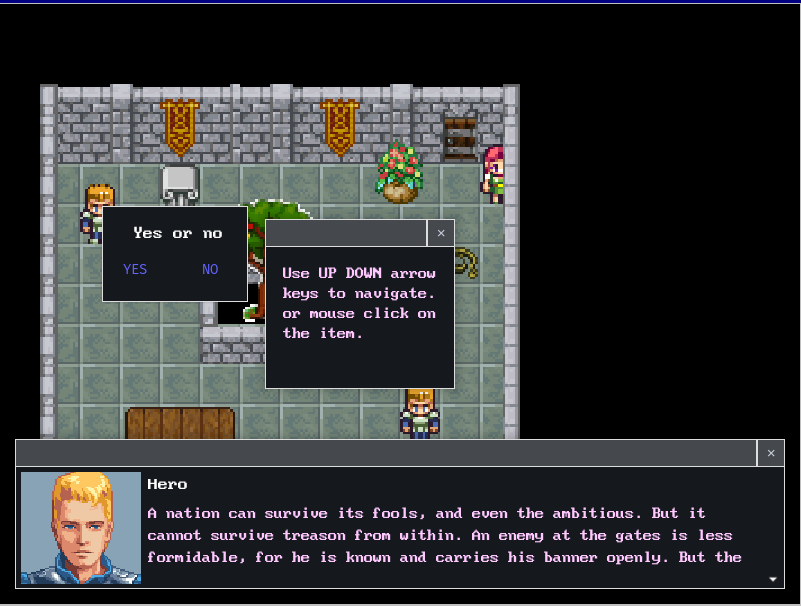

# py-rpg-01
jRPG Game in Pygame




## Install
```bash
pip install -r requirements.txt
```

## Update requirements
```bash
pip freeze > requirements.txt
```

## Tests
```commandline
python -m unittest discover -s tests
```
### single test
```commandline
python -m unittest .\tests\test_map_builder.py
```

# Learning notes
[notes](./notes.md)
